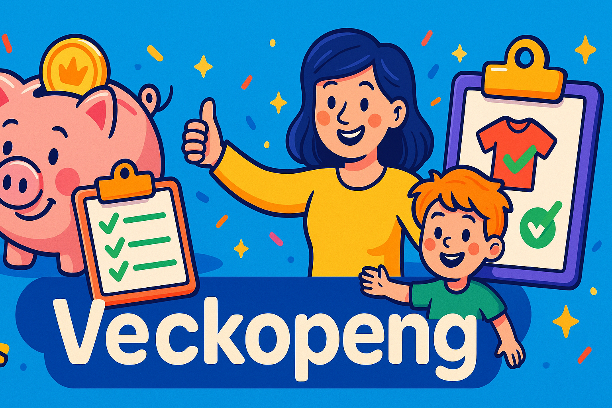

# Veckopeng

A modern, family-friendly app for managing chores, weekly allowance, and payment deep links — designed for self-hosting, privacy, and simplicity.

---

## 🌟 Overview

**Veckopeng** is a lightweight but powerful family app where parents can:

- Create and assign tasks (chores)
- Set reward amounts
- Track each child’s weekly allowance
- Trigger payment directly from their phone’s payment app

Children complete tasks ➜ parents approve them ➜ the reward is added to the child’s balance.  
At the end of the week, the parent taps **Pay**, and Veckopeng opens the payment app with the **phone number**, **amount**, and optional **message** pre-filled.

Veckopeng is built for **self-hosting** using Docker and keeps all your data in your own environment.

---

## 📚 Table of Contents

- [Features](#-features)
- [Payment Deep Links](#-payment-deep-links)
- [Self-Hosted by Design](#-self-hosted-by-design)
- [Getting Started](#-getting-started)
- [Configuration](#-configuration)
- [Tech Stack](#-tech-stack)
- [Contributing](#-contributing)
- [Support](#-support)
- [License](#-license)
- [Roadmap](#-roadmap)

---

## ✨ Features

### 👨‍👩‍👧 Family Management

- Add **parents** and **children**
- Assign phone numbers per user
- Role-based experience:
  - Children see a simplified “My tasks / My week” view
  - Parents can manage tasks, approvals, and payments

### 📝 Task & Reward System

- Create chores with:
  - Title and description
  - Optional category
  - Reward amount
- Children mark tasks as **completed**
- Tasks remain **pending** until approved or rejected by a parent
- Approved tasks automatically increase the child’s running balance

---

## 💸 Payment Deep Links

Veckopeng uses **payment deep links**, similar to the mechanism used by Swish and other mobile payment apps.

This allows Veckopeng to open a payment app on your device with:

- The child’s phone number pre-filled  
- The total amount pre-filled  
- An optional message (e.g. “Weekly allowance”)

### Current & Upcoming Providers

- ✅ Swish-style deep link support  
- 🚧 Work in progress: support for additional providers that use URL schemes / payment deep links  
  (e.g. MobilePay, Vipps, and other mobile payment apps that support opening with pre-filled phone number and amount)

The core idea is to keep the payment flow:

> *Tap once in Veckopeng ➜ your payment app opens ➜ confirm ➜ done.*

---

## 🏡 Self-Hosted by Design

Veckopeng is built for people who like to run their own services:

- 🐳 Runs as a Docker container
- 💾 Uses persistent storage so your data survives restarts
- 🔒 No external cloud backend required
- 🌐 Ideal for homelab setups, NAS installations, or small VPS servers

You control:

- Where it runs  
- Who has access  
- How it integrates into your home environment  

Inside the app, a small, discrete **“Buy Me a Coffee”** link is available for parents if you want to support the development of the project. It is not shown in child views.

---

## 🚀 Getting Started

### 1. Clone the repository

```bash
git clone https://github.com/daevilb/veckopeng.git
cd veckopeng
2. Start via Docker Compose
Make sure you have Docker and Docker Compose installed, then run:

bash
Copy code
docker compose up -d
3. Open the app
Open your browser and go to:

text
Copy code
http://localhost:3000
On first launch, you will:

Create the first parent account

Set up your family members

Start creating tasks and rewards

⚙️ Configuration
Veckopeng is designed to run with sensible defaults, but you can customize it using environment variables.

Variable	Default	Description
VP_PORT	3000	Port the app listens on
VP_DATA_PATH	/data	Directory used for persistent data

Example Docker Compose snippet (conceptual):

yaml
Copy code
services:
  veckopeng:
    image: veckopeng:latest
    container_name: veckopeng
    ports:
      - "3000:3000"
    environment:
      - VP_PORT=3000
      - VP_DATA_PATH=/data
    volumes:
      - ./data:/data
    restart: unless-stopped
Adapt the image name and paths to match your actual build/publish setup.

🧱 Tech Stack
Frontend: React + TypeScript

State & Storage: Local persistence (file/volume-backed)

Runtime: Node / modern frontend tooling

Containerization: Docker

Payments: Deep link / URL scheme based payment flows (Swish-style and similar)

UI: Responsive layout for both mobile and desktop

🤝 Contributing
Contributions, ideas, and feedback are very welcome!

You can:

Open issues for bugs or feature requests

Submit pull requests with improvements

Propose UX/UI enhancements, new payment providers, or quality-of-life features

The long-term goal is to make Veckopeng:

As smooth and fun as possible for families, while remaining simple to self-host.

☕ Support
If you enjoy using Veckopeng and want to support the ongoing development:

Use the Buy Me a Coffee link available in the parent view inside the app

Share the project with others who might find it useful

Provide feedback and feature ideas via issues

Every bit of support helps to keep the project evolving.

📜 License
Veckopeng is open source and released under the GNU Affero General Public License v3 (AGPL-3.0).

See LICENSE for the full license text.

For commercial use cases, including internal business use that does not wish to follow AGPL terms, a separate commercial license is available. See COMMERCIAL_LICENSE.md for details.

In short:

✅ You can use, modify, and self-host the app under AGPL-3.0

✅ Changes and improvements distributed or used over a network must remain open source under the same license

🔒 Commercial use outside AGPL terms requires a separate agreement

🛣️ Roadmap
I’m actively working on improving Veckopeng and look forward to:

Enhancing the overall UI/UX and layout, especially on larger screens

Adding light/dark theme support

Improving the onboarding flow for parents and children

Supporting additional payment providers via deep links

Adding more quality-of-life features for families and self-hosters

If you have ideas or features you would love to see, please open an issue or reach out — the goal is to make this app as good and useful as possible for real families.
